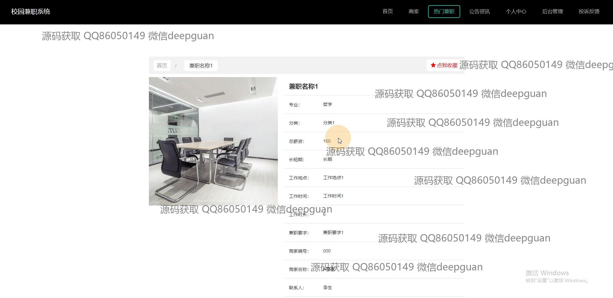
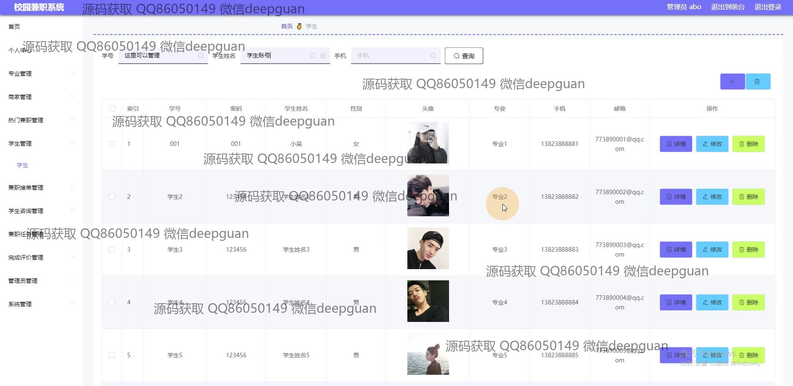
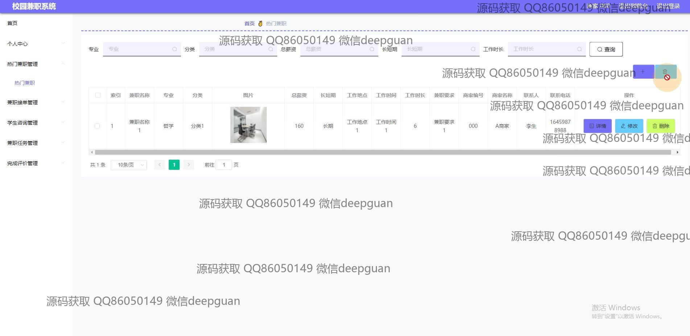
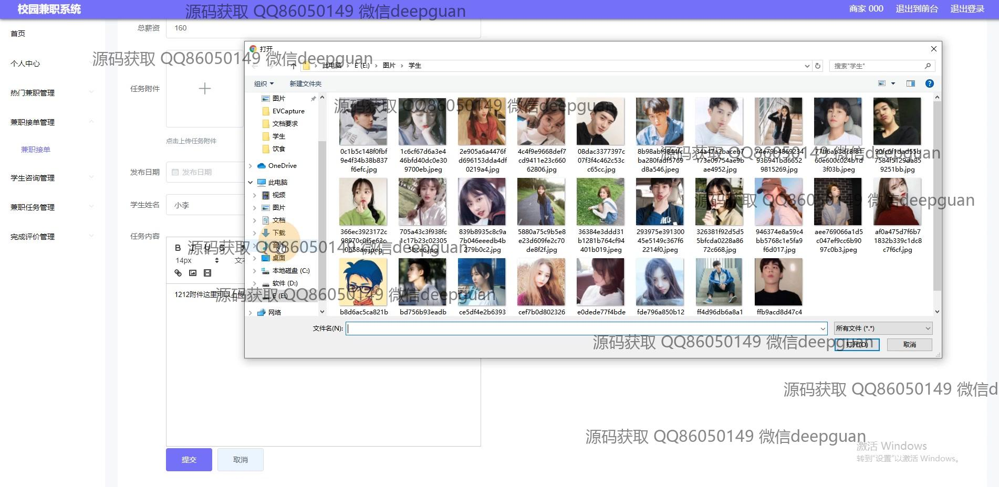

<h1 align="center">的校园大学生兼职系统vue</h1>

## 简介
校园大学生兼职管理系统：角色分为管理员和用户，主要功能包括用户信息管理、兼职信息的发布与审核、商家管理、任务反馈及系统安全退出功能。    --计算机毕业设计源码；毕设源码；java毕业设计源码

## 联系方式

<h3 align="center">获取完整代码与数据库文件 + 微信：deepguan QQ: 86050149 QQ群: 783742310</h3>

<h3 align="center">可帮忙远程部署 包运行成功！提供远程部署、修改代码、设计文档指导、代码讲解等服务！</h3>

## 功能介绍（完整见运行截图）
管理员：基本功能包括登录、注册和安全退出，能够管理系统中的用户账户与信息。主要界面为管理视图，提供丰富的功能模块，如个人中心、专业管理、商家管理、兼职管理、学生咨询管理、评价管理、系统管理等，支持查询和筛选用户和任务信息，实现兼职任务和信息的高效管理与评估。

商家：可以通过系统发布和管理兼职任务，支持任务信息的查询、编辑和删除功能。可以查看与管理商家的基本信息，跟踪任务的进展及学生的反馈，确保兼职信息的准确和有效，并可与学生进行在线咨询来解决任务相关问题。

学生：通过系统注册、登录后，能够浏览商家信息和兼职任务，查看任务详情并进行查询及申请。个人中心模块允许管理和修改个人信息，提供评论和反馈功能，帮助改善兼职任务的质量，同时支持收藏和管理感兴趣的兼职信息。

用户：主要与系统进行交互，通过主界面执行兼职信息的查询、申请及反馈。包括进入个人中心进行个人信息验证及修改，执行和管理兼职任务，提供查看和管理浏览记录的功能，确保个人信息与任务信息的安全有效管理。

## 运行截图

本代码来源于网络,仅供学习参考使用!

